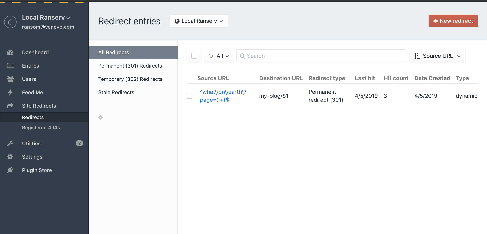
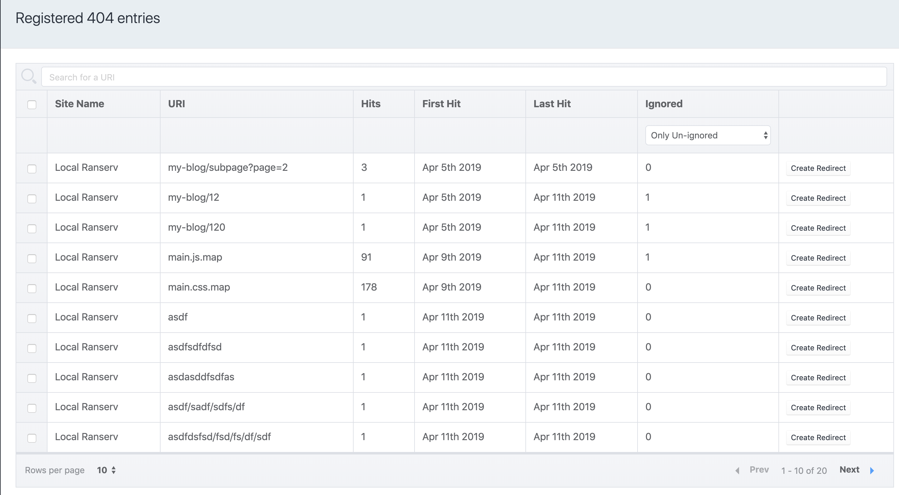
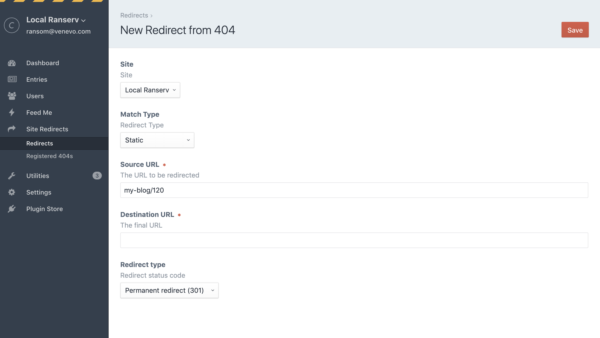

# Craft CMS 3.1 Redirect Manager
**Note**
This is a fork of the original redirect plugin by Dolphiq with efforts to better 
maintain and support it. The codebase has been overhauled to have minimal impact on
the website when not in use. 404s are now registered in the database and matched via
regular expressions rather than application routes. This means your dynamic route 
format will have changed from the previous version of the plugin. 

Additionally, the registered 404s has been rebuilt to better handle more numerous entries.

See the "Issues" section in GitHub to see the project roadmap. 

## Requirements
This plugin requires Craft CMS 3.1.19 or later - also tested on 3.2 alpha.

## Installation

[Click here](INSTALL.md) for the installation readme.

### Example of the redirect overview

### Example of the missed URLs overview

### Creating a redirect from a 404 entry

## Using the Redirect plugin

You can use the Redirect plugin to redirect simple routes but also use it for
more advanced route matches.

[Click here](RULES.md) for the complete overview of rule examples.

### Contributors & Developers
Johan Zandstra - info@dolphiq.nl

Venveo - info@venveo.com
