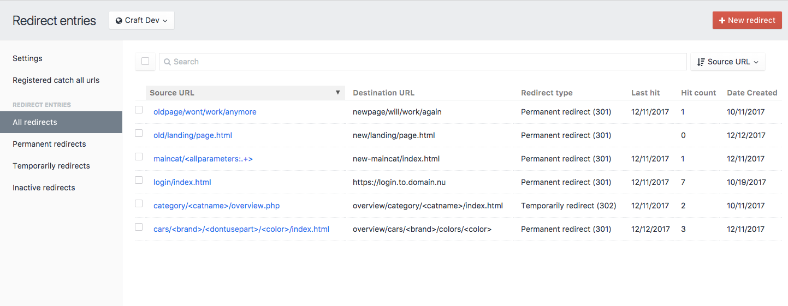
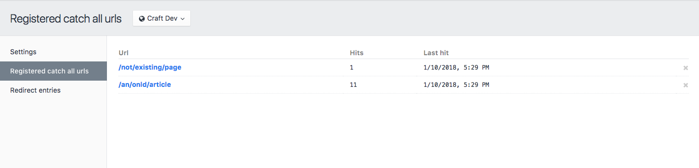
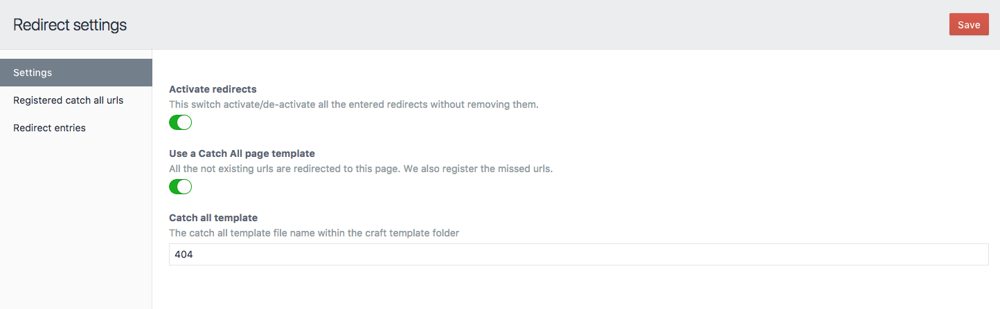

# Craft CMS 3.x Redirect Manager

Craft plugin that provides an easy way to enter and maintain 301 and 302 redirects. The plugin provides a clear user interface for admin and non-admin users.

This is particularly useful if you are migrating pages from an old website and want to avoid dead links and want to keep the page ranks for the SEO. But also useful if you are making (big) changes in the site (url) structure.

The plugin registers and shows the last hit date and hit count per visited redirect.

As a new (experimental) feature the redirect also give you the ability to enable a catch all page to handle all the not existing urls. The plugin will register and count the hits on this not existing pages in a different section and makes it easy to create new redirect rules directly from missed / not existing URLs by simply clicking on the URL.

**Note**: This plugin may become a paid add-on when the Craft Plugin store becomes available.

## Requirements
This plugin requires Craft CMS 3.0.14 or later.

## Installation

[Click here](INSTALL.md) for the installation readme.

### Example of the redirect overview


### Example of the missed URLs overview


### Settings screen



## Using the Redirect plugin

You can use the Redirect plugin to redirect simple routes but also use it for more advanced route matches. See some examples below.

### Simple redirect exact match
Source URL:
```
oldpage/wont/work/anymore
```
Destination URL:
```
newpage/will/work/again
```

### Simple redirect to an other (sub)domain
Source URL:
```
oldpage/wont/work/anymore
```
Destination URL:
```
https://www.newwebsite.com/newpage/will/work/again
```

### More advanced redirect with a parameter
Source URL:
```
category/<catname>/overview.php
```
Destination URL:
```
overview/category/<catname>/index.html
```
[Click here](RULES.md) for the complete overview of rule examples.

## Redirect Manager Roadmap

Potential features:

* Dashboard with statistics
* CSV import/export of the redirects
* Add a priority property for (partly) overlapping urls

### Created by
- Dolphiq - Johan Zandstra - dolphiq.nl
- Venveo - Ransom Roberson - venveo.com

### Other Contributors
- 24hoursmedia
- Mosnar
- boscho87
- HelgeSverre
- ohlincik


