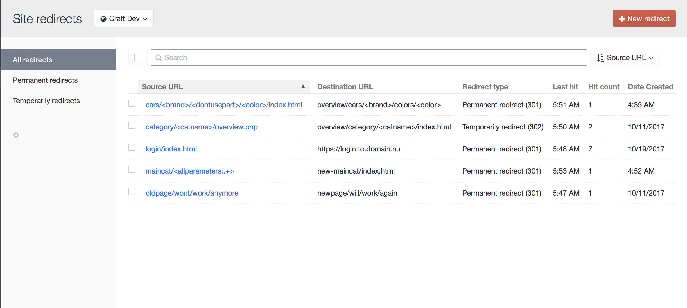

# Craft CMS 3.x Redirect Manager

Craft plugin that provides an easy way to enter and maintain 301 and 302 redirects. The plugin provides a clear user interface for admin and non-admin users.

This is particularly useful if you are migrating pages from an old website and want to avoid dead links and want to keep the page ranks for the SEO. But also useful if you are making (big) changes in the site (url) structure.

The plugin also registers and shows the last hit date and hit count per visited redirect.

**Note**: This plugin may become a paid add-on when the Craft Plugin store becomes available.

## Requirements
This plugin requires Craft CMS 3.0.0-RC1 or later.

## Installation

To install the plugin, follow these instructions.

1. Open your terminal and go to your Craft project:

        cd /path/to/project

2. Then tell Composer to load the plugin:

        composer require dolphiq/redirect

3. In the Control Panel, go to Settings → Plugins and click the “Install” button for Redirect plugin.

4. The redirect plugin will be visible in the settings view on in the plugins section


### Example of the redirect overview


## Using the Redirect plugin

You can use the Redirect plugin to redirect simple routes but also use it for more advanced route matches. See some examples below.

### Simple redirect exact match
Source URL:
```
oldpage/wont/work/anymore
```
Destination URL:
```
newpage/will/work/again
```

### Simple redirect to an other (sub)domain
Source URL:
```
oldpage/wont/work/anymore
```
Destination URL:
```
https://www.newwebsite.com/newpage/will/work/again
```

### More advanced redirect with a parameter
Source URL:
```
category/<catname>/overview.php
```
Destination URL:
```
overview/category/<catname>/index.html
```

### Multiple parameters mixed
Source URL:
```
cars/<brand>/<dontusepart>/<color>/index.html
```
Destination URL:
```
overview/cars/<brand>/colors/<color>
```
*note: it is not required to use all the source parameters in the destination URL

### Replace a uri parameter in de source string to a new path

Source URL:
```
books/detail
```
Destination URL:
```
book-detail/<bookId>/index.html
```

Example: the original url looks like:
```
books/detail?bookId=124
```

After the redirect, the url will look like:
```
book-detail/124/index.html
```

### Replace a long path with unknown amount of segments for an other url

Source URL:
```
wholepath/<options:.+>
```
Destination URL:
```
otherpath/index.html?cat=<a>&subcat=<b>
```

Example: the original url looks like:
```
wholepath/this/is/a/long/path/with/params?a=1&b=2&c=4
```

After the redirect, the url will look like:
```
/otherpath/index.html?cat=1&subcat=2
```


### Contributors & Developers
Johan Zandstra - info@dolphiq.nl
Brought to you by [Dolphiq](https://dolphiq.nl)
