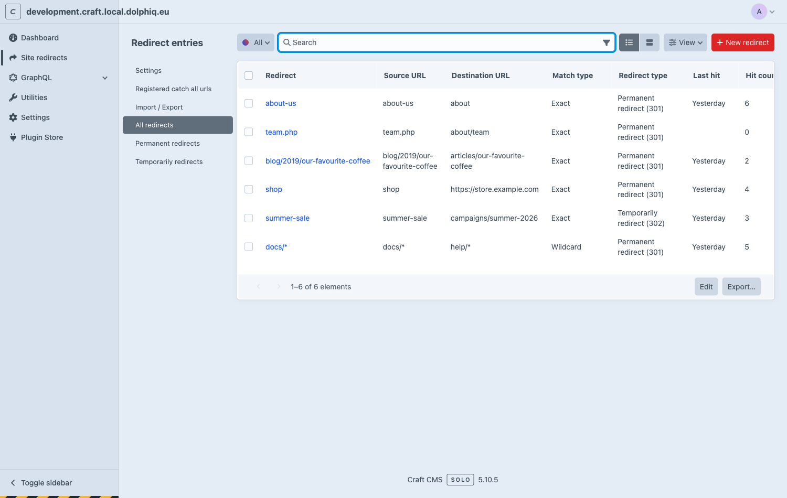
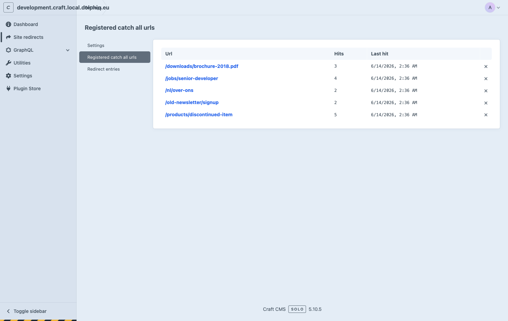
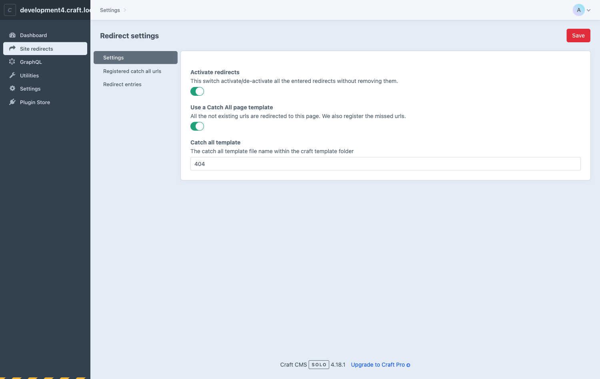

<h1 align="center">Redirect Manager for Craft CMS</h1>

<p align="center">
  Create and manage <strong>301</strong> and <strong>302</strong> redirects, catch every <strong>404</strong>,
  and turn missed URLs into redirects with a single click — straight from the Craft control panel.
</p>

<p align="center">
  <a href="https://packagist.org/packages/dolphiq/redirect"></a>
  
  
  <a href="LICENSE.md"></a>
  <a href="https://packagist.org/packages/dolphiq/redirect"></a>
</p>

<p align="center">
  
</p>

> **Actively maintained by [Dolphiq](https://dolphiq.nl).** Redirect Manager is free and open source under the MIT license.

---

## Why Redirect Manager?

Restructuring a site, migrating from an old CMS, or renaming pages? Don't lose your visitors — or
your SEO ranking — to dead links. Redirect Manager lets editors and developers manage redirects
themselves, without touching server config or deploying code.

- ⚡ **Zero performance overhead.** Redirects are resolved with a fast database lookup; there's no
  per-request cost for visitors hitting valid pages.
- 🧑‍💻 **Made for everyone.** A clean, native control-panel UI that admins *and* non-admin authors can use.
- 🔁 **Permanent (301) & temporary (302)** redirects, with per-redirect status codes.
- 🧩 **Pattern matching** with named parameters for advanced, rule-based routing.
- 🎯 **Catch-all 404 handling** — register every missed URL and create a redirect from it in one click.
- 📊 **Insight built in** — each redirect tracks its hit count and last-hit date.
- 🌐 **Multi-site aware** — manage redirects per site.
- 🔌 **Feed Me support** — bulk-import redirects from CSV, XML and JSON feeds.
- 🗣️ **Translated** — ships with English, Dutch, German and Norwegian.

## Requirements

| | Version |
|---|---|
| Craft CMS | 4.0 or later |
| PHP | 8.0 or later |

> Using Craft 3? Install the `1.x` release line. Craft 5 support is on the [roadmap](#roadmap).

## Installation

**From the Craft Plugin Store** — go to **Settings → Plugins**, search for **Redirect Manager**, and click **Install**.

**With Composer:**

```bash
composer require dolphiq/redirect
php craft plugin/install redirect
```

That's it — open **Site redirects** in the control panel and add your first redirect.

## Usage

Add a redirect under **Site redirects → New redirect**. Provide a source URL, a destination URL,
and choose the redirect type. A few common patterns:

#### Rename a page (exact match)

```
Source URL:       about-us
Destination URL:  about
```

#### Redirect to another (sub)domain

```
Source URL:       shop
Destination URL:  https://store.example.com
```

#### Match a parameter and reuse it

```
Source URL:       category/<catname>/overview.php
Destination URL:  overview/category/<catname>
```

👉 See [RULES.md](RULES.md) for the full reference of matching rules and more examples.

## Catch-all 404 handling

Enable **Use a Catch All page template** in the plugin settings and point it at a Twig template.
Every URL that would otherwise 404 is then served by that template (with a proper `404` status)
and recorded in the **Registered catch all urls** list — including a hit count and last-hit date.

Spot a URL that should point somewhere? Click it to create a redirect instantly.

<p align="center">
  
</p>

## Settings

<p align="center">
  
</p>

- **Activate redirects** — globally enable or disable all redirects without deleting them.
- **Use a Catch All page template** — turn on 404 handling and missed-URL tracking.
- **Catch all template** — the Twig template that renders your 404 page.

## Roadmap

- Craft 5 support
- Dashboard widget with redirect & 404 statistics
- CSV import/export from the control panel
- Priority handling for overlapping rules

Have an idea or found a bug? [Open an issue](https://github.com/Dolphiq/craft-plugin-redirect/issues) — contributions are welcome.

## Credits

Created and maintained by **[Dolphiq](https://dolphiq.nl)** — Johan Zandstra.

With thanks to all [contributors](https://github.com/Dolphiq/craft-plugin-redirect/graphs/contributors),
including Venveo (Ransom Roberson), 24hoursmedia, Mosnar, boscho87, HelgeSverre and ohlincik.

## License

Released under the [MIT License](LICENSE.md).
