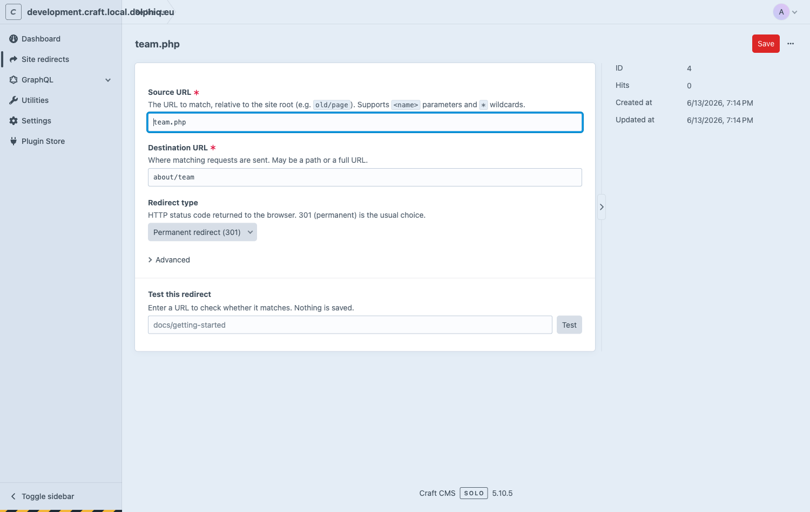
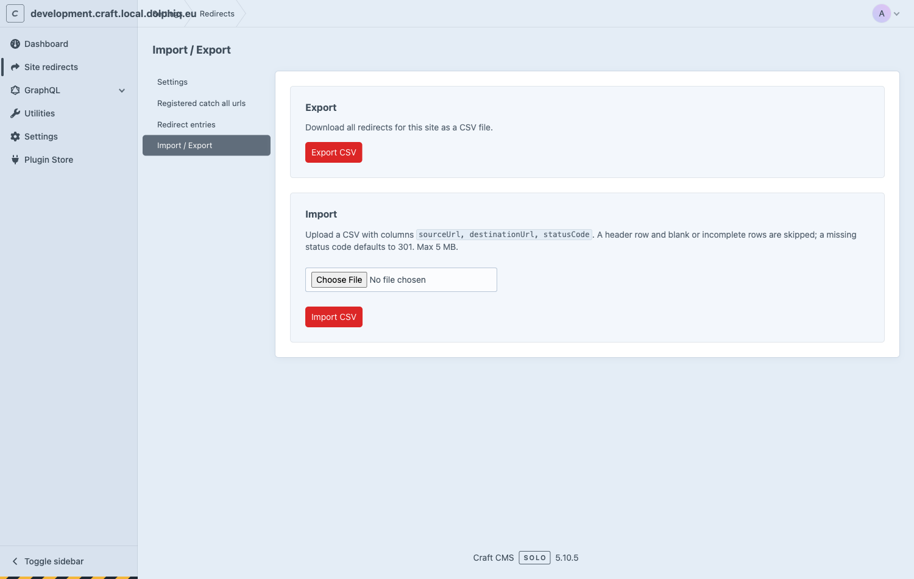
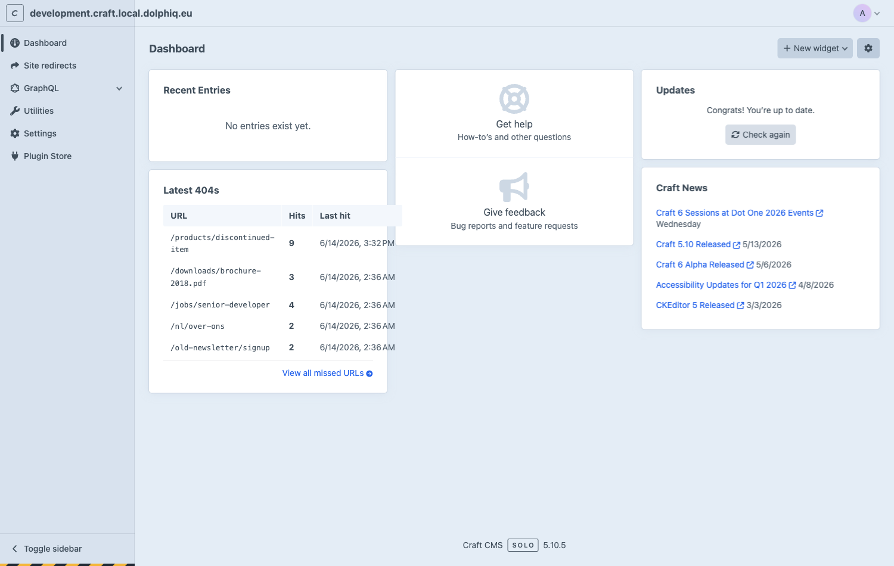

<h1 align="center">Redirect Manager for Craft CMS</h1>

<p align="center">
  Create and manage <strong>301</strong> and <strong>302</strong> redirects, catch every <strong>404</strong>,
  and turn missed URLs into redirects with a single click — straight from the Craft control panel.
</p>

<p align="center">
  <a href="https://packagist.org/packages/dolphiq/redirect"></a>
  
  
  <a href="LICENSE.md"></a>
  <a href="https://packagist.org/packages/dolphiq/redirect"></a>
</p>

<p align="center">
  
</p>

> **Actively maintained by [Dolphiq](https://dolphiq.nl).** Redirect Manager is free and open source under the MIT license.

---

## Why Redirect Manager?

Restructuring a site, migrating from an old CMS, or renaming pages? Don't lose your visitors — or
your SEO ranking — to dead links. Redirect Manager lets editors and developers manage redirects
themselves, without touching server config or deploying code.

- ⚡ **Zero overhead on healthy pages.** Redirects resolve *only* when a URL would otherwise 404 —
  matches are cached and never run on pages that already exist. A live page is never shadowed.
- 🔁 **Permanent (301) & temporary (302)** redirects, with per-redirect status codes.
- 🧩 **Flexible matching** — exact, `<name>` named parameters, and `*` wildcards, substituted into the destination.
- 🪄 **Automatic redirects on URI change** — rename an entry and a 301 is created for you (loop-safe).
- 🎯 **Catch-all 404 handling** — register every missed URL and create a redirect from it in one click.
- 📥 **CSV import/export** — bulk-manage redirects from the control panel.
- 📊 **Insight built in** — per-redirect hit count + last-hit date, plus a **"Latest 404s" dashboard widget**.
- 🔗 **GraphQL** — query your redirects via the API.
- 🧑‍💻 **Made for everyone.** A clean, native control-panel UI for admins *and* non-admin authors.
- 🌐 **Multi-site aware** · 🔌 **Feed Me support** · 🗣️ **Translated into 16 languages** (EN, NL, DE, FR, ES, IT, DA, NB, SV, PT, PT-BR, PL, CS, FI, JA, ZH-CN, RU).

## Requirements

| | Version |
|---|---|
| Craft CMS | 5.0 or later |
| PHP | 8.2 or later |

> On an older Craft? Use the `2.x` release line for **Craft 4**, or `1.x` for **Craft 3**.

## Installation

**From the Craft Plugin Store** — go to **Settings → Plugins**, search for **Redirect Manager**, and click **Install**.

**With Composer:**

```bash
composer require dolphiq/redirect
php craft plugin/install redirect
```

That's it — open **Site redirects** in the control panel and add your first redirect.

## Upgrading

Each release line tracks a Craft major. Upgrade Craft and the plugin together, one major at a time.

| Plugin | Craft | PHP |
|--------|-------|-----|
| `1.x`  | Craft 3 | 7.x – 8.0 |
| `2.x`  | Craft 4 | 8.0.2+ |
| `3.x`  | Craft 5 | 8.2+ |

After any upgrade, **run the migrations** (the control panel will also prompt you):

```bash
composer require dolphiq/redirect:^3.0   # match your target Craft major
php craft migrate/all
php craft project-config/apply           # if you deploy project config
```

**Craft 3 → 4 (`1.x` → `2.x`)**
- Requires PHP 8.0+. The element index moves to Craft 4's `_layouts/elementindex`.
- Query-string parameters are now passed through to the destination on a successful redirect.
- No redirect data changes — your existing redirects keep working.

**Craft 4 → 5 (`2.x` → `3.x`)**
- Requires Craft 5 and PHP 8.2+.
- **Behaviour change — redirects no longer shadow real pages.** Resolution is now *event-based*: a
  redirect is only applied when a URL would otherwise 404. Previously a redirect could override a
  page that existed at the same path; now the real page wins. If you relied on that shadowing,
  recreate those as content/route changes.
- Migrations add `matchType`, `priority`, `postDate`/`expiryDate` and the 404-analytics tables, and
  back-fill a match type for every existing redirect (inferred from its source). Existing redirects
  keep working unchanged.
- 404 analytics are **opt-in** (off by default) and store no personal data — enable them in
  **Settings** if you want them.
- **Deploy note:** reset PHP **opcache** on deploy (or enable `opcache.validate_timestamps`), or new
  control-panel actions can 404 until the cache clears.

See the [changelog](CHANGELOG.md) for the full list of changes per version.

## Usage

Add a redirect under **Site redirects → New redirect**. Pick a **match type**, enter a source and
destination URL, choose the redirect type — and use **Test this redirect** to check a URL before saving.

<p align="center">
  
</p>

A few common patterns:

#### Rename a page (exact match)

```
Source URL:       about-us
Destination URL:  about
```

#### Redirect to another (sub)domain

```
Source URL:       shop
Destination URL:  https://store.example.com
```

#### Match a parameter and reuse it

```
Source URL:       category/<catname>/overview.php
Destination URL:  overview/category/<catname>
```

#### Wildcards

```
Source URL:       docs/*
Destination URL:  help/*
```

`docs/getting-started` → `help/getting-started`. The `*` matches across path segments and is
substituted into the matching `*` in the destination.

👉 See [RULES.md](RULES.md) for the full reference of matching rules and more examples.

## Automatic redirects

When an entry's URI changes (you rename or move it), Redirect Manager creates a **301** from the old
URI to the new one automatically — and removes any reverse redirect so renames can't loop. Toggle it
with the `autoCreateRedirectOnUriChange` setting.

## Import & export (CSV)

On the **Site redirects → Import / Export** page, use **Export CSV** to download all redirects, or
**Import CSV** to bulk-add them. Columns: `sourceUrl, destinationUrl, statusCode` (a header row and
blank/incomplete rows are skipped; missing status codes default to `301`).

<p align="center">
  
</p>

## GraphQL

Query your redirects through Craft's GraphQL API:

```graphql
{
  redirects(siteId: 1) {
    sourceUrl
    destinationUrl
    statusCode
    hitCount
  }
}
```

## Catch-all 404 handling

Enable **Use a Catch All page template** in the plugin settings and point it at a Twig template.
Every URL that would otherwise 404 is then served by that template (with a proper `404` status)
and recorded in the **Registered catch all urls** list — including a hit count and last-hit date.

Spot a URL that should point somewhere? Click it to create a redirect instantly.

<p align="center">
  
</p>

Keep an eye on them from the dashboard with the **Latest 404s** widget:

<p align="center">
  
</p>

## Settings

<p align="center">
  
</p>

- **Activate redirects** — globally enable or disable all redirects without deleting them.
- **Use a Catch All page template** — turn on 404 handling and missed-URL tracking.
- **Catch all template** — the Twig template that renders your 404 page.
- **Automatic redirects on URI change** — create a 301 automatically when an element's URI changes.

## Documentation

- **[Matching rules](RULES.md)** — exact, named `<name>`, constrained `<name:regex>`, wildcard `*`, and query-string parameters.
- **[Developer reference](DEVELOPERS.md)** — settings, service API, events, caching, GraphQL and Feed Me.

## Roadmap

- Priority/ordering control for overlapping rules
- Richer 404 analytics

Have an idea or found a bug? [Open an issue](https://github.com/Dolphiq/craft-plugin-redirect/issues) — contributions are welcome.

## Credits

Created and maintained by **[Dolphiq](https://dolphiq.nl)** — Johan Zandstra.

With thanks to all [contributors](https://github.com/Dolphiq/craft-plugin-redirect/graphs/contributors),
including Venveo (Ransom Roberson), 24hoursmedia, Mosnar, boscho87, HelgeSverre and ohlincik.

## License

Released under the [MIT License](LICENSE.md).
